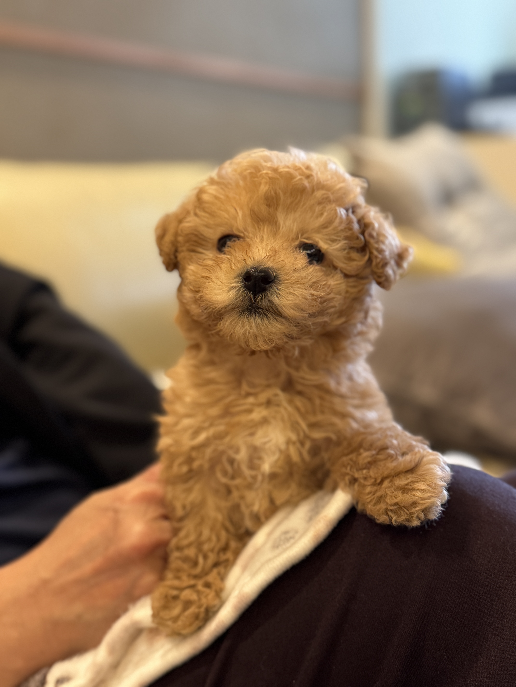

# Hello, my name is Wey, Kuan-Yu (衛冠瑜) - Testing Version1

Download [CV](CV_Kuan-Yu-2025.pdf)

<a href="../CV_Kuan-Yu-2025.pdf" target="_blank" rel="noopener noreferrer"
   style="display:inline-block;
          padding:10px 18px;
          background:#007acc;
          color:#fff;
          text-decoration:none;
          border-radius:6px;
          font-weight:bold;">
  &#8594; Download CV
</a>
  
## Research

I’m a PhD candidate at [Quantum Matter Design Studio](https://sites.google.com/g.ucla.edu/quantum/) in University of California - Los Angeles (UCLA). 
My research focuses on low-dimensional materials characterization. I specialize using scanning tunnelin microscope (STM) and angular resolved photoemission spectroscopy (ARPES) to probe the surface atomic-resolution image and band structure. My current research topic is **Probing the Atomic-scale Dynamics of a Quasi-1D Charge Density Wave System by in-plane Current-Tuned Scanning Tunneling Microscopy and Spectroscopy (STM/STS)**. The project uses STM ... 

On the page [STM and ARPES](https://kywey.github.io/Instrument_intro/) I'm attaching some useful review papers of these instruments and my personal insights (might be just superficial understanding) of them.
[TestLink](Instrument_intro.md)

## Life
During my spare time, I play table tennis (not professional, but not a rookie), go boulder at climbing gyms (SenderOne Westwood ~V6-V8 levels), or cook (?). Honestly as a PhD student, even though I'm living in one of the most popular city in the world, we don't play too much but study hard (seriously? prob NO). In the past, I was a 50/50 dog/cat person; ever since we had Cooby (literally Cool Baby) as our new family member on 2024/10/17, I'm 100% dog lover. Please go to [life page](life.md) for witnessing Cooby's growing history.

<!--  -->
<!--  -->

As an innocent kid             |  As a naughty kid
:-------------------------:|:-------------------------:
  |  

## Selected Projects/Awards/Publication

  <h3>Main PhD Project</h3>
  
Low-dimensional materials

  

<!-- 
Go to <a href="https://www.google.com">Google</a>.
 -->
<!-- 
<a href="B.md">Go to B page</a>
 -->

  <h3>PhD Fellowship</h3>
  
I have been awarded Julian Schwinger Fellowship from <a href="https://www.schwingerfellowship.pa.ucla.edu"> Julian Schwinger Foundation at UCLA </a> since 2021/10 until 2025/09. 

  <h3>Some Publication</h3>
  
J. Green, H. W. T. Morgan, ..., K.-Y. Wey, ... et al. <a href="https://journals.aps.org/prb/abstract/10.1103/PhysRevB.111.085139" > Mapping the three-dimensional fermiology of the triangular lattice magnet EuAg4⁢Sb2 </a> <em>Physical Review B 111, 085139, 2025</em> 

  
K.-Y. Wey, M. M. Stoba, S. Brown, C. Gutierrez. <a href="https://stm25.org/index.php?GP=program/pag" > Imaging and Tuning Microscope Phase in a Charge Density Wave. </a> <em>IBS Conference on STM'25</em> 

 
